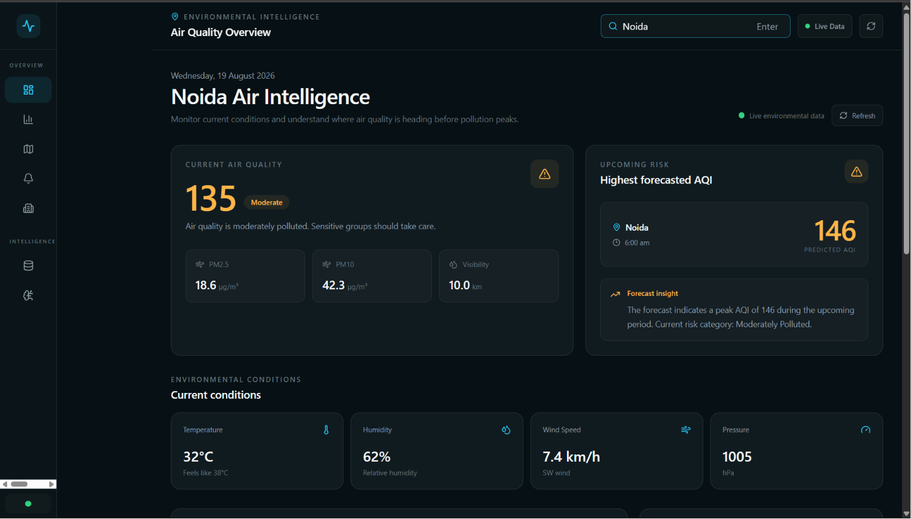
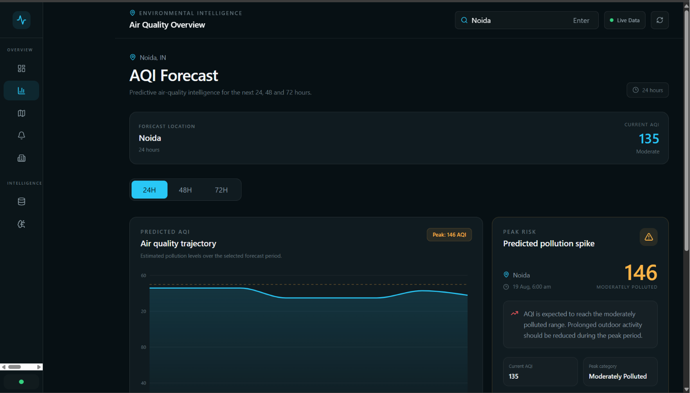
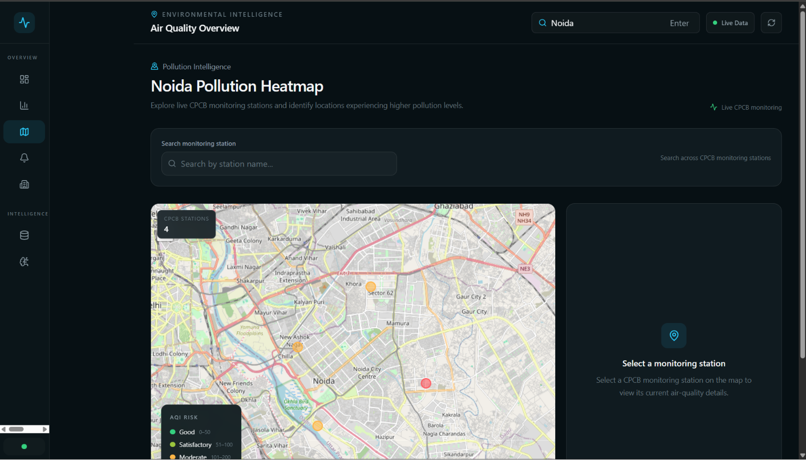
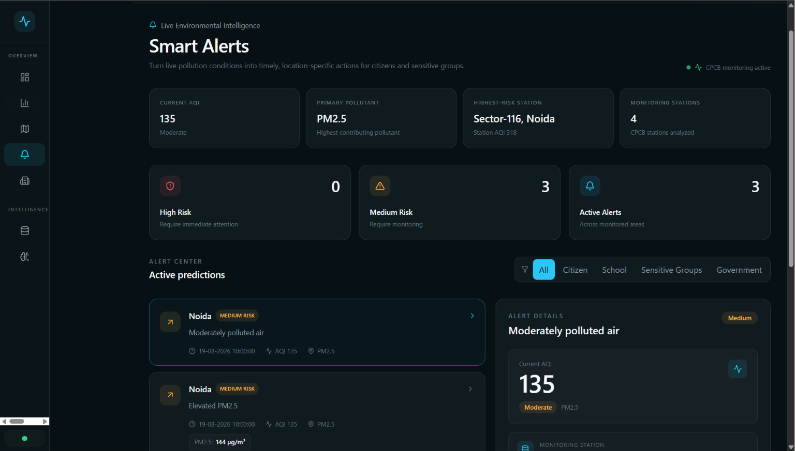
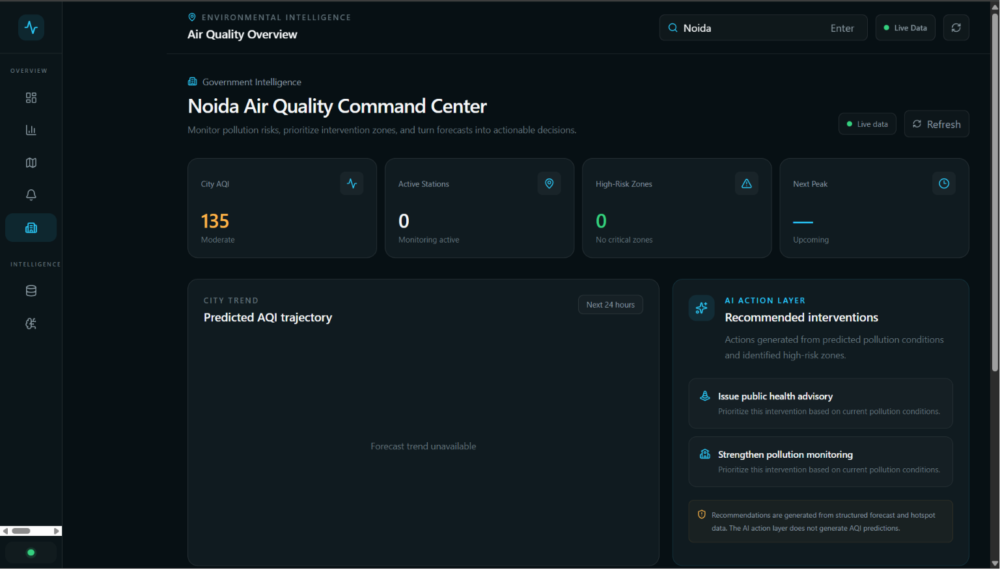
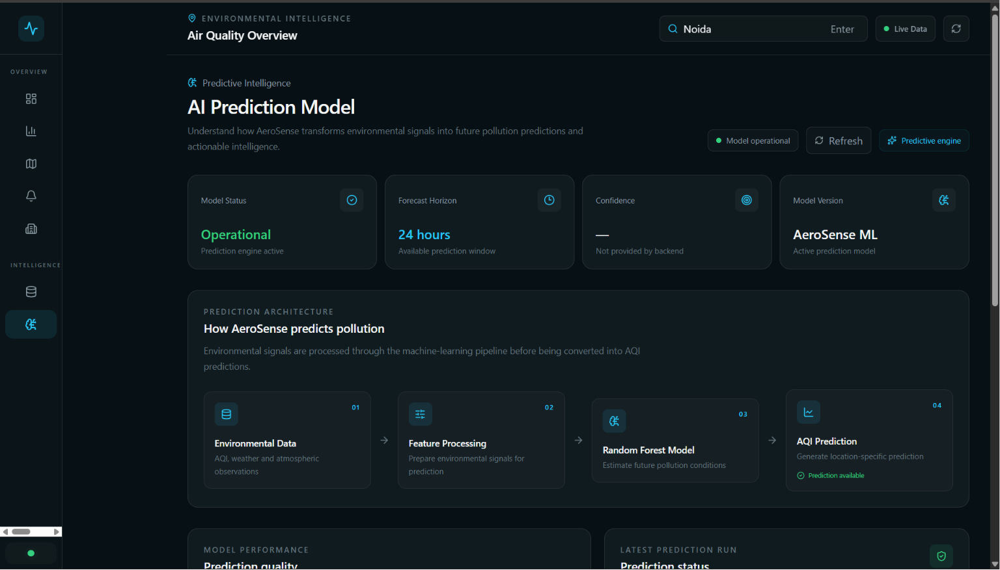
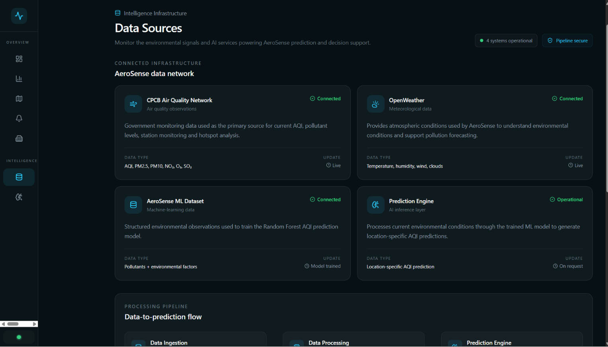

# 🌍 AeroSense

### Predict the Air Before It Becomes a Problem

AeroSense is an environmental intelligence platform that combines
real-time air-quality data, environmental conditions, pollution
hotspots, forecasting, machine-learning prediction, smart alerts, and
government-oriented insights in one responsive web application.

Instead of only answering **"What is the AQI right now?"**, AeroSense is
designed to help answer:

> **What is likely to happen next, where could pollution become a
> problem, and what should we do about it?**

------------------------------------------------------------------------

## 🚀 Live Demo

-   **Live Application:** https://aerosense-web-qy88.onrender.com/
-   **Backend API:** https://aerosense-api-9nkw.onrender.com/
-   **GitHub Repository:**
    https://github.com/shivamchaudhary19/aerosense
-   **Project Presentation:** [AeroSense Hackathon
    Presentation](docs/AeroSense_Hackathon_Presentation.pptx)

> **Note:** The ML prediction service is deployed with the backend. Free
> hosting instances may take a short time to wake up after inactivity.

------------------------------------------------------------------------

# 🎯 Problem Statement

Air-quality platforms often focus on showing current AQI values. While
current AQI is important, it is not enough for proactive
decision-making.

Citizens may need to know when outdoor exposure is likely to become
risky. Schools may need to identify potentially unsafe outdoor periods.
Authorities may need to identify pollution hotspots and prioritize
interventions.

AeroSense addresses this gap by moving from:

**Reactive Monitoring → Predictive Intelligence → Proactive Action**

------------------------------------------------------------------------

# 💡 Our Solution

AeroSense brings together:

-   Current AQI intelligence
-   Pollutant information
-   Environmental conditions
-   Monitoring-station data
-   Interactive pollution heatmaps
-   AQI forecasting
-   Machine-learning prediction
-   Smart pollution alerts
-   Government-oriented recommendations

The result is a single environmental intelligence platform that helps
users understand both **current conditions and potential future risk**.

------------------------------------------------------------------------

# ✨ Key Features

## 1. 📊 Environmental Intelligence Dashboard

The dashboard provides a centralized overview of the selected location.

It includes:

-   Current AQI
-   AQI category
-   Primary pollutant
-   Environmental conditions
-   Prediction information
-   Monitoring information
-   System status



------------------------------------------------------------------------

## 2. 🔮 AQI Forecasting

AeroSense provides a forecasting interface for different prediction
horizons:

-   24 hours
-   48 hours
-   72 hours

The forecast is presented visually so users can identify potential
pollution peaks and understand how environmental conditions may
influence them.



------------------------------------------------------------------------

## 3. 🗺️ Pollution Heatmap

The heatmap visualizes available monitoring stations and their AQI
levels.

Each station can provide:

-   Station name
-   AQI
-   AQI category
-   Primary pollutant
-   Coordinates
-   Last update

AQI-based marker colors make higher-risk monitoring locations easier to
identify.



------------------------------------------------------------------------

## 4. 🚨 Smart Alerts

AeroSense converts pollution conditions and predicted risk into
actionable alerts.

The alert layer is designed to communicate:

-   Pollution severity
-   Risk level
-   Location
-   Predicted conditions
-   Recommended actions
-   Relevant stakeholder groups



------------------------------------------------------------------------

## 5. 🏛️ Government Intelligence

The Government module provides a decision-oriented view of environmental
conditions.

It focuses on:

-   Pollution risk
-   High-risk locations
-   Monitoring priorities
-   Recommended interventions
-   Action-oriented environmental insights



------------------------------------------------------------------------

## 6. 🤖 AI Prediction Model

AeroSense includes a dedicated AI/ML interface explaining the prediction
pipeline.

The current prediction architecture is:

``` text
Environmental Data
        ↓
Feature Processing
        ↓
Random Forest Model
        ↓
AQI Prediction
```

The prediction engine is kept separate from the action layer so that
forecasts and recommendations can be evaluated independently.



------------------------------------------------------------------------

## 7. 📡 Data Sources

AeroSense integrates public environmental data and weather/environmental
information.

The current implementation uses:

-   CPCB monitoring-station data
-   data.gov.in
-   Environmental/weather API data
-   Monitoring-station coordinates
-   Pollutant measurements



------------------------------------------------------------------------

# 🧠 How AeroSense Works

``` text
                 ┌─────────────────────────┐
                 │   Environmental Data    │
                 │                         │
                 │ CPCB / Weather / AQI    │
                 └────────────┬────────────┘
                              │
                              ▼
                 ┌─────────────────────────┐
                 │   Data Processing       │
                 │                         │
                 │ Cleaning + Features     │
                 └────────────┬────────────┘
                              │
                 ┌────────────┴────────────┐
                 │                         │
                 ▼                         ▼
       ┌───────────────────┐     ┌───────────────────┐
       │ Current AQI       │     │ ML Prediction     │
       │ & Hotspots        │     │ Random Forest     │
       └─────────┬─────────┘     └─────────┬─────────┘
                 │                         │
                 └────────────┬────────────┘
                              ▼
                 ┌─────────────────────────┐
                 │ Intelligence Layer     │
                 │                         │
                 │ Forecasts               │
                 │ Heatmap                 │
                 │ Smart Alerts            │
                 │ Government Insights     │
                 └────────────┬────────────┘
                              │
                              ▼
                 ┌─────────────────────────┐
                 │ Users & Authorities     │
                 └─────────────────────────┘
```

------------------------------------------------------------------------

# 🧮 AQI Calculation

AeroSense processes available pollutant measurements and derives AQI
information using pollutant-specific concentration breakpoints.

The system works with pollutants including:

-   PM2.5
-   PM10
-   NO₂
-   O₃
-   SO₂
-   NH₃
-   CO

For monitoring-station intelligence, AeroSense retains individual
station readings and identifies the highest-risk station separately from
the representative city-level reading.

This allows the interface to communicate both:

``` text
Representative City Condition
+
Highest-Risk Monitoring Location
```

instead of hiding spatial differences behind a single number.

------------------------------------------------------------------------

# 🤖 Machine Learning

The current ML pipeline uses a **Random Forest** model for AQI
prediction.

Environmental inputs are prepared as model features before being passed
to the trained predictor.

### Prediction Pipeline

``` text
Environmental Inputs
        ↓
Feature Preparation
        ↓
Random Forest Predictor
        ↓
Predicted AQI
        ↓
AQI Category
        ↓
Frontend Intelligence
```

The prediction endpoint is integrated with the production backend and
returns location-specific prediction results.

------------------------------------------------------------------------

# 🏗️ System Architecture

``` text
                         ┌─────────────────────┐
                         │   React Frontend    │
                         │                     │
                         │ Dashboard / Maps    │
                         │ Forecast / Alerts   │
                         └──────────┬──────────┘
                                    │
                                  REST
                                    │
                                    ▼
                         ┌─────────────────────┐
                         │   Express Backend   │
                         │                     │
                         │ Routes               │
                         │ Controllers          │
                         │ Services             │
                         └───────┬───────┬─────┘
                                 │       │
                   ┌─────────────┘       └─────────────┐
                   ▼                                   ▼
        ┌────────────────────┐             ┌────────────────────┐
        │ CPCB / data.gov.in │             │ Weather /          │
        │ Monitoring Data    │             │ Environmental Data │
        └──────────┬─────────┘             └─────────┬──────────┘
                   │                                  │
                   └────────────────┬─────────────────┘
                                    ▼
                         ┌─────────────────────┐
                         │ Python ML Predictor │
                         │ Random Forest       │
                         └─────────────────────┘
```

------------------------------------------------------------------------

# 🛠️ Technology Stack

## Frontend

-   React
-   Vite
-   Tailwind CSS
-   React Router
-   Recharts
-   React Leaflet
-   Leaflet
-   Lucide React

## Backend

-   Node.js
-   Express.js
-   REST APIs
-   CORS
-   dotenv

## Machine Learning

-   Python
-   scikit-learn
-   pandas
-   NumPy
-   joblib
-   Random Forest

## Data & APIs

-   CPCB monitoring data
-   data.gov.in
-   Environmental/weather API data
-   Public monitoring-station information

## Deployment

-   GitHub
-   Docker
-   Render

------------------------------------------------------------------------

# 📁 Project Structure

``` text
aerosense/
│
├── backend/
│   ├── src/
│   │   ├── config/
│   │   ├── controllers/
│   │   ├── routes/
│   │   ├── services/
│   │   ├── utils/
│   │   └── app.js
│   ├── package.json
│   └── .env.example
│
├── frontend/
│   ├── public/
│   ├── src/
│   │   ├── assets/
│   │   ├── components/
│   │   ├── pages/
│   │   ├── services/
│   │   ├── App.jsx
│   │   ├── App.css
│   │   ├── index.css
│   │   └── main.jsx
│   ├── package.json
│   └── vite.config.js
│
├── ml/
│   ├── data/
│   ├── models/
│   ├── src/
│   │   └── predictor.py
│   └── requirements.txt
│
├── docs/
│   ├── screenshots/
│   │   ├── dashboard.png
│   │   ├── forecast.png
│   │   ├── heatmap.png
│   │   ├── smart-alerts.png
│   │   ├── government.png
│   │   ├── ai-model.png
│   │   └── data-sources.png
│   └── AeroSense_Hackathon_Presentation.pptx
│
├── Dockerfile
├── .gitignore
├── README.md
└── ...
```

------------------------------------------------------------------------

# 🔌 API Endpoints

Production API base:

``` text
https://aerosense-api-9nkw.onrender.com/api
```

## Health Check

``` http
GET /health
```

Checks whether the backend service is operational.

------------------------------------------------------------------------

## Current Environment

``` http
GET /environment/current?location=Noida
```

Returns current environmental and AQI information.

------------------------------------------------------------------------

## Forecast

``` http
GET /forecast?location=Noida&hours=24
```

Returns forecast information for the requested location and horizon.

Supported horizons:

``` text
24
48
72
```

------------------------------------------------------------------------

## Pollution Hotspots

``` http
GET /hotspots?location=Noida
```

Returns monitoring-station hotspot information.

------------------------------------------------------------------------

## Smart Alerts

``` http
GET /alerts?location=Noida
```

Returns pollution alerts for the selected location.

------------------------------------------------------------------------

## Government Summary

``` http
GET /government/summary?location=Noida
```

Returns government-oriented environmental insights.

------------------------------------------------------------------------

## ML Prediction

``` http
GET /prediction?location=Noida
```

Returns the current AQI and the model's predicted AQI.

Example production response:

``` json
{
  "success": true,
  "data": {
    "location": {
      "name": "Noida",
      "country": "IN",
      "state": "Uttar Pradesh",
      "coordinates": {
        "latitude": 28.5706333,
        "longitude": 77.3272147
      }
    },
    "currentAQI": 135,
    "currentCategory": "Moderate",
    "prediction": {
      "predictedAQI": 71,
      "category": "Satisfactory"
    }
  }
}
```

------------------------------------------------------------------------

# ⚙️ Local Setup

## 1. Clone the Repository

``` bash
git clone https://github.com/shivamchaudhary19/aerosense.git
cd aerosense
```

------------------------------------------------------------------------

# Backend Setup

``` bash
cd backend
npm install
```

Create a `.env` file:

``` env
PORT=5000
DATA_GOV_API_KEY=your_data_gov_api_key
OPENWEATHER_API_KEY=your_openweather_api_key
```

Start the backend:

``` bash
npm run dev
```

Backend runs locally on:

``` text
http://localhost:5000
```

------------------------------------------------------------------------

# Frontend Setup

Open another terminal:

``` bash
cd frontend
npm install
```

Create a `.env` file:

``` env
VITE_API_BASE_URL=http://localhost:5000/api
```

Start the frontend:

``` bash
npm run dev
```

------------------------------------------------------------------------

# 🐍 ML Setup

Navigate to the ML directory:

``` bash
cd ml
```

Create a virtual environment:

``` bash
python -m venv .venv
```

### Windows

``` powershell
.venv\Scripts\activate
```

### Install dependencies

``` bash
pip install -r requirements.txt
```

The trained prediction model is used by the Python predictor and
integrated with the backend prediction flow.

------------------------------------------------------------------------

# 🔐 Environment Variables

Never commit API keys or secrets to GitHub.

### Backend

``` env
DATA_GOV_API_KEY=
OPENWEATHER_API_KEY=
```

### Frontend

``` env
VITE_API_BASE_URL=
```

Production values are configured through the deployment platform.

------------------------------------------------------------------------

# 🚀 Deployment

AeroSense is deployed as separate frontend and backend services.

### Frontend

``` text
Render Static Site
```

### Backend

``` text
Render Docker Web Service
```

The backend Docker environment contains the Node.js API and Python ML
runtime required for prediction.

Production flow:

``` text
User
 ↓
React Frontend
 ↓
Render
 ↓
Express API
 ├── Environmental Services
 ├── AQI Processing
 ├── Hotspots
 ├── Alerts
 ├── Government Insights
 └── ML Prediction
       ↓
   Python Predictor
       ↓
 Random Forest Model
```

------------------------------------------------------------------------

# 📸 Screenshots

## Dashboard


## Forecast


## Pollution Heatmap


## Smart Alerts


## Government Intelligence


## AI Prediction Model


## Data Sources


------------------------------------------------------------------------

# 👥 Target Users

## Citizens

AeroSense helps users:

-   Understand current AQI
-   Identify pollution hotspots
-   View forecasted conditions
-   Understand pollution risk
-   Receive actionable alerts

## Schools

Schools can use environmental intelligence to:

-   Identify potentially unsafe outdoor periods
-   Monitor local pollution conditions
-   Prepare activity adjustments

## Government & Authorities

Authorities can use the platform to:

-   Identify high-risk areas
-   Monitor pollution hotspots
-   Prioritize interventions
-   Use predictive information for planning

------------------------------------------------------------------------

# 🏆 What Makes AeroSense Different?

Traditional AQI platforms mainly answer:

> **"What is the air quality right now?"**

AeroSense aims to answer:

> **"What is likely to happen next, where, and what should we do?"**

The platform combines:

``` text
AQI Intelligence
      +
Forecasting
      +
Spatial Hotspots
      +
Smart Alerts
      +
Government Insights
```

into a single environmental intelligence workflow.

------------------------------------------------------------------------

# 🎯 Current MVP

The current hackathon MVP focuses on a working real-data environmental
intelligence pipeline.

Implemented capabilities include:

-   Real monitoring-station data
-   AQI intelligence
-   Environmental data integration
-   Pollution heatmap
-   Forecast interface
-   Random Forest-based AQI prediction
-   Smart alerts
-   Government insights
-   Responsive web interface
-   Production frontend deployment
-   Production backend deployment
-   Dockerized backend

------------------------------------------------------------------------

# ⚠️ Limitations

AeroSense is currently a hackathon MVP.

Important limitations include:

-   Prediction quality depends on the available training data.
-   AQI predictions represent model estimates and are not guaranteed
    future measurements.
-   Monitoring-station availability varies by location.
-   The current implementation is focused on a limited geographic scope.
-   Free hosting infrastructure can introduce cold-start delays.
-   Larger historical datasets and longer validation periods would be
    required for production-grade forecasting.

These limitations are explicitly acknowledged so that model outputs are
interpreted responsibly.

------------------------------------------------------------------------

# 🔭 Future Scope

Potential future improvements include:

### Multi-city Expansion

Extend the platform to additional cities and regions.

### More Environmental Data

Integrate:

-   Additional ground sensors
-   More historical datasets
-   Additional meteorological signals
-   Satellite/environmental observations

### Advanced Forecasting

Evaluate additional approaches such as:

-   Gradient Boosting
-   XGBoost
-   Time-series models
-   Deep learning models

### Better Model Evaluation

Introduce systematic:

-   MAE
-   RMSE
-   R²
-   Cross-validation
-   Time-based validation

### Automated Intervention Intelligence

Generate more advanced recommendations for:

-   Traffic management
-   Schools
-   Construction activity
-   Public events
-   Emergency pollution response

------------------------------------------------------------------------

# 📈 Impact

AeroSense aims to move environmental intelligence from:

``` text
Reactive Monitoring
        ↓
Predictive Intelligence
        ↓
Proactive Action
```

By providing earlier information about potential pollution events, the
platform can help stakeholders prepare before pollution conditions
become more severe.

------------------------------------------------------------------------

# 📦 Submission Checklist

This repository is prepared for the GitHub submission round and
contains:

-   [x] Public GitHub repository
-   [x] Complete frontend source code
-   [x] Complete backend source code
-   [x] Machine-learning source code
-   [x] Configuration files
-   [x] Docker deployment configuration
-   [x] README.md
-   [x] Application screenshots
-   [x] Live deployment
-   [x] Backend API deployment
-   [x] Project presentation
-   [x] Genuine Git commit history

------------------------------------------------------------------------

# 👨‍💻 Team

### AeroSense

-   **Shivam Chaudhary**
-   **Satyam Tripathi**
-   **Raj Singh**

------------------------------------------------------------------------

# 🌐 Project Links

-   **Live Application:** https://aerosense-web-qy88.onrender.com/
-   **Backend API:** https://aerosense-api-9nkw.onrender.com/
-   **GitHub Repository:**
    https://github.com/shivamchaudhary19/aerosense
-   **Presentation:** [View AeroSense Hackathon
    Presentation](docs/AeroSense_Hackathon_Presentation.pptx)

------------------------------------------------------------------------

# 📜 Project Status

  Component                 Status
  ------------------------- ----------------
  Frontend                  🟢 Deployed
  Backend                   🟢 Deployed
  ML Prediction             🟢 Operational
  Environmental Data        🟢 Integrated
  Forecasting               🟢 Operational
  Pollution Heatmap         🟢 Operational
  Smart Alerts              🟢 Operational
  Government Intelligence   🟢 Operational
  Responsive UI             🟢 Implemented

------------------------------------------------------------------------

## 🏆 Built for the GitHub Submission Round

> **AeroSense --- Predict the air before it becomes a problem.**
